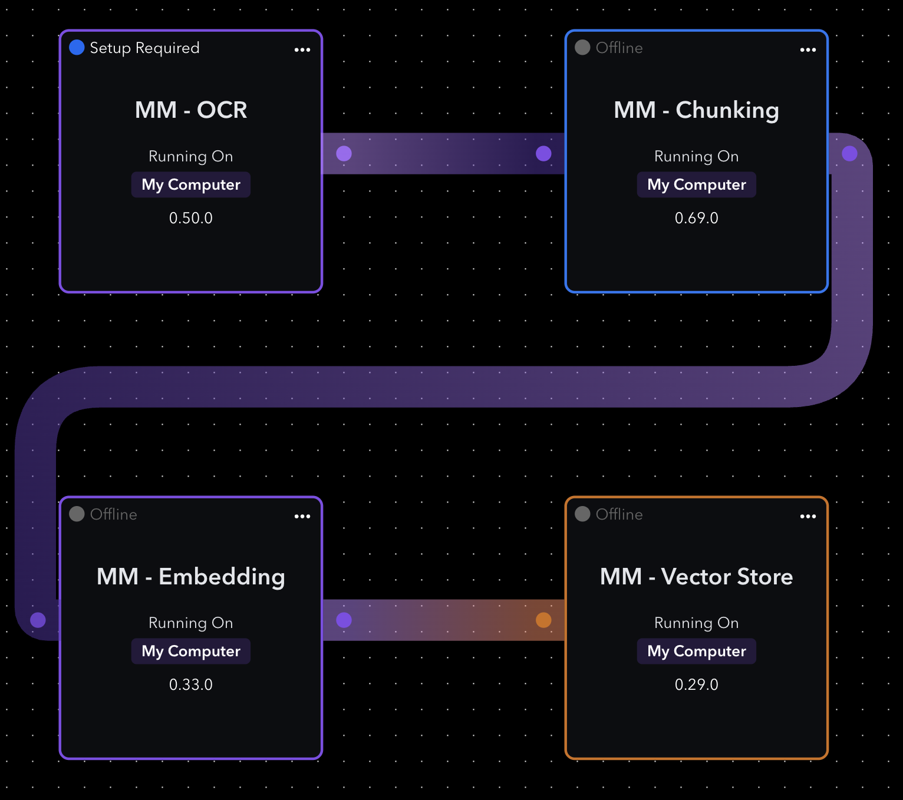
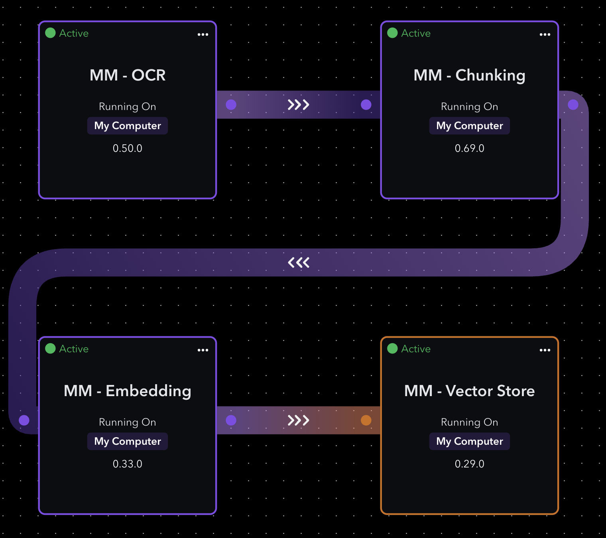
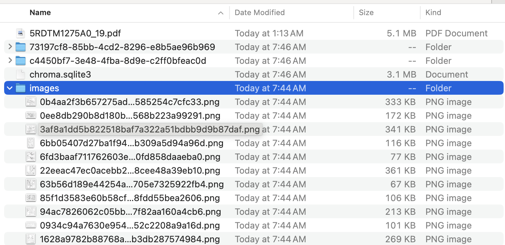
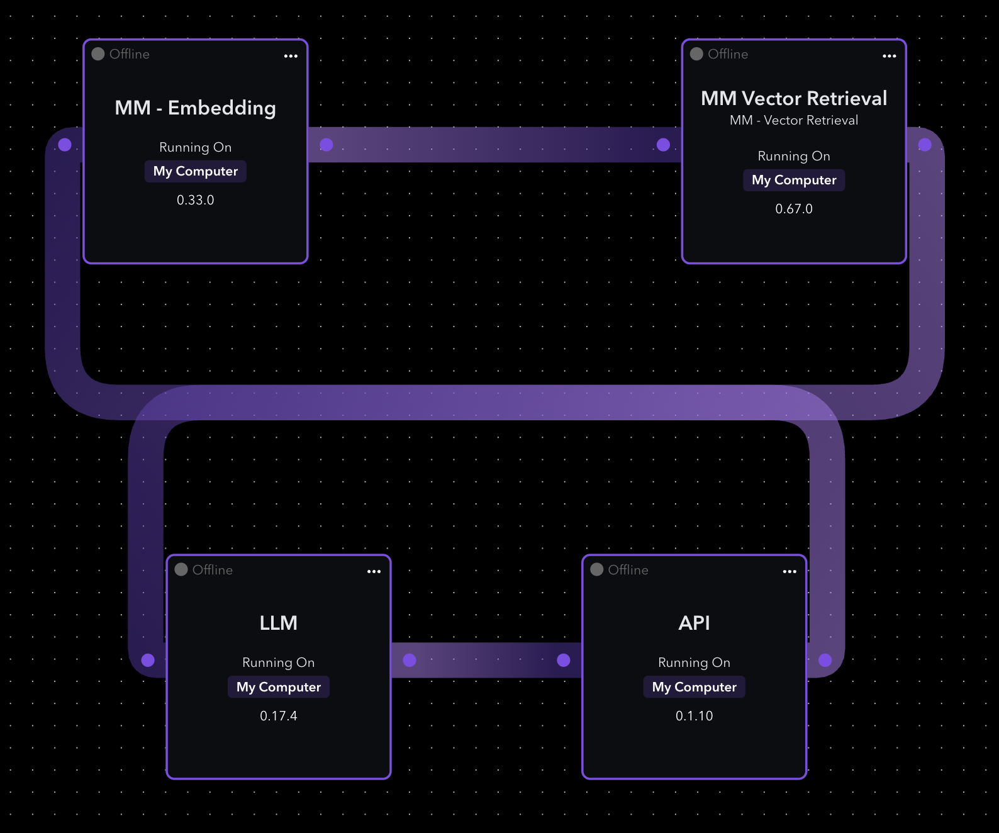

# MultiModal RAG

## Installation
Clone repository
```bash
$ git clone https://github.com/ktenzer/webai-multimodal-rag.git
$ cd webai-multimodal-rag
```

Side load elements
```bash
 $ /Applications/Navigator.app/Contents/Resources/support/builder import ocr
 $ /Applications/Navigator.app/Contents/Resources/support/builder import chunking
 $  /Applications/Navigator.app/Contents/Resources/support/builder import embedding
 $  /Applications/Navigator.app/Contents/Resources/support/builder import vector_store
 $  /Applications/Navigator.app/Contents/Resources/support/builder import vector_retrieval
 ```

## Ingest Configuration
First wire MM OCR, Chunking, Embedding and Vector Store elements.


Under OCR settings you need to select a data directory and images directory. The data directory should contain your pdf(s) and images directory is where clipped imaged will be saved. Ensure you don't use same directory for data and images.

Under Vector Store settings set the vectordb directory.

Example:
- Data directory: /my/data
- Images directory: /my/data/images
- VectorDB directory: /my/data



After ingest completes you should see the vectordb and image clippings. Since text and image_text is separated this shows as separate dbs for ChromaDB or tables in PostgresmL.



## Inference Configuration
Connect API, LLM, MM Embedding and MM Vector Retrieval elements.



Under MM Embedding ensure the "Is Ingestion" toggle is set to False. In the MM Vector Retrieval select location of vectordb, same directory you created it in during ingest phase.

